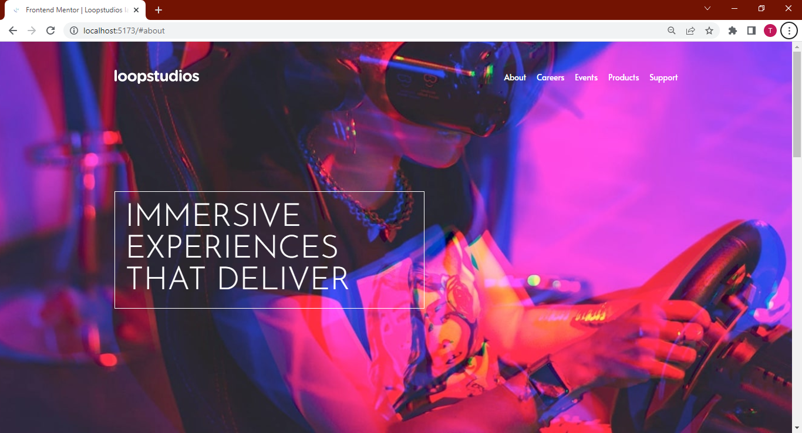
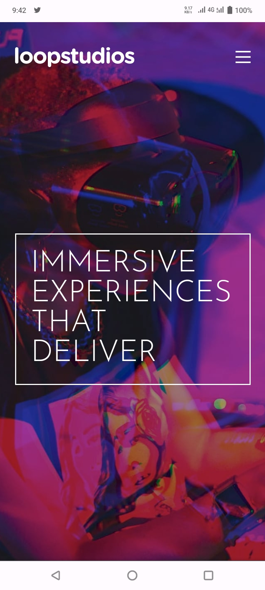

# Frontend Mentor - Loopstudios landing page solution

This is a solution to the [Loopstudios landing page challenge on Frontend Mentor](https://www.frontendmentor.io/challenges/loopstudios-landing-page-N88J5Onjw). Frontend Mentor challenges help you improve your coding skills by building realistic projects.

## Table of contents

- [Overview](#overview)
  - [The challenge](#the-challenge)
  - [Screenshot](#screenshot)
  - [Links](#links)
- [My process](#my-process)
  - [Built with](#built-with)
  - [What I learned](#what-i-learned)
  - [Useful resources](#useful-resources)
- [Author](#author)

## Overview

### The challenge

Users should be able to:

- View the optimal layout for the site depending on their device's screen size
- See hover states for all interactive elements on the page

### Screenshot

### Links

- Solution URL: [Solution on GitHub](https://github.com/Dev-Dylann/loopstudios-landing-page/)
- Live Site URL: [Loopstudios Landing Page](https://devdylann-loopstudios.netlify.app)

## My Process

### Built with

- Mobile-first workflow
- [Tailwind CSS](https://tailwindcss.com/) - CSS Framework
- [React](https://reactjs.org/) - JS library
- Fonts from [Google Fonts](https://)

### What I Learned

One of the major things I learned durring this project was the `group` class in Tailwind that lets me style elements based on the state of a parent element.

### Useful Resources

- [Tailwwind Docs](https://tailwindcss.com/docs/installation) - The Tailwind Documentation really helped me discover classes I wasn't previously familiar with like `leading-{size}`, `tracking-{size}` and `origin-{position}`.

## Author

- GitHub - [DevDylan](https://github.com/Dev-Dylann)
- Frontend Mentor - [@Dev-Dylann](https://www.frontendmentor.io/profile/Dev-Dylann)
- Twitter - [@TunmiseTubi](https://www.twitter.com/TunmiseTubi)
